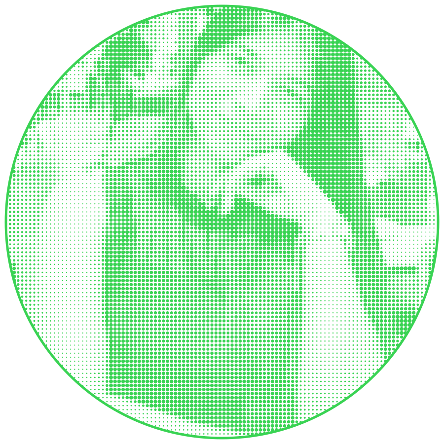
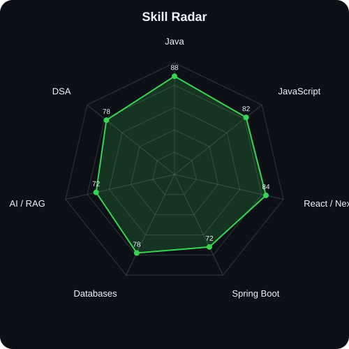
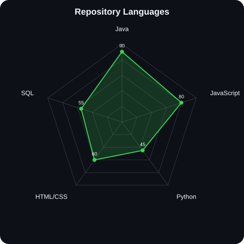
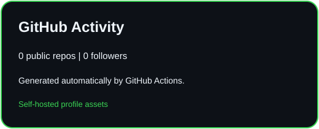
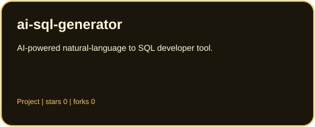
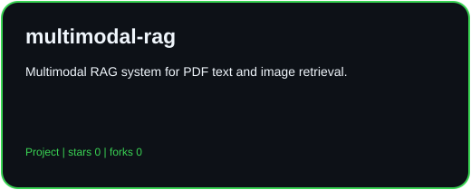

<div align="center">

# Hi, I'm Samruddhi Ghawade


<p>
<a href="https://www.linkedin.com/in/samruddhi-ghawade-967744327/"></a>
<a href="mailto:ghawadesamruddhi19@gmail.com"></a>
<a href="YOUR_PORTFOLIO"></a>
<a href="https://github.com/Samruddhi192105"></a>
</p>


</div>

---

<div align="center"></div>

## `~/` whoami

```console
$ cat about.txt
```

Hi, I'm **Samruddhi**, a Computer Engineering student focused on backend and full-stack development.

- Currently building **AI Agent Swarm** - a multi-agent software engineering system
- Building with **Java, Spring Boot, Next.js, PostgreSQL and Docker**
- Exploring **AI/ML, RAG systems, LLM applications and developer tooling**
- Solving DSA problems and strengthening software engineering fundamentals

---

## Toolbox

<p align="center">

</p>

---

## Skill Radar

<table>
<tr>
<td width="50%" align="center">

**Self-rated**

<picture>
<source media="(prefers-color-scheme: dark)" srcset="assets/radar-dark.svg">
<source media="(prefers-color-scheme: light)" srcset="assets/radar-light.svg">

</picture>

</td>
<td width="50%" align="center">

**From my repositories**

<picture>
<source media="(prefers-color-scheme: dark)" srcset="assets/radar-langs-dark.svg">
<source media="(prefers-color-scheme: light)" srcset="assets/radar-langs-light.svg">

</picture>

</td>
</tr>
</table>

---

## Contribution Activity

<div align="center">

<picture>
<source media="(prefers-color-scheme: dark)" srcset="assets/metrics-dark.svg">
<source media="(prefers-color-scheme: light)" srcset="assets/metrics-light.svg">

</picture>

<br><br>

<picture>
<source media="(prefers-color-scheme: dark)" srcset="https://raw.githubusercontent.com/Samruddhi192105/Samruddhi192105/output/snake-dark.svg">
<source media="(prefers-color-scheme: light)" srcset="https://raw.githubusercontent.com/Samruddhi192105/Samruddhi192105/output/snake.svg">

</picture>

</div>

---

## GitHub Stats

<p align="center">
<picture>
<source media="(prefers-color-scheme: dark)" srcset="assets/stats-dark.svg">
<source media="(prefers-color-scheme: light)" srcset="assets/stats-light.svg">

</picture>
</p>

---

## Featured Projects

<table>
<tr>
<td width="50%">
<a href="https://github.com/Samruddhi192105/ai-sql-generator">
<picture>
<source media="(prefers-color-scheme: dark)" srcset="assets/card-ai-sql-generator-dark.svg">
<source media="(prefers-color-scheme: light)" srcset="assets/card-ai-sql-generator-light.svg">

</picture>
</a>
</td>

<td width="50%">
<a href="https://github.com/Samruddhi192105/multimodal-rag">
<picture>
<source media="(prefers-color-scheme: dark)" srcset="assets/card-multimodal-rag-dark.svg">
<source media="(prefers-color-scheme: light)" srcset="assets/card-multimodal-rag-light.svg">

</picture>
</a>
</td>
</tr>

<tr>
<td width="50%">
<a href="https://github.com/Samruddhi192105">
<picture>
<source media="(prefers-color-scheme: dark)" srcset="assets/card-densepose-dark.svg">
<source media="(prefers-color-scheme: light)" srcset="assets/card-densepose-light.svg">

</picture>
</a>
</td>

<td width="50%">
<a href="https://github.com/Samruddhi192105/ai-agent-swarm">
<picture>
<source media="(prefers-color-scheme: dark)" srcset="assets/card-agent-swarm-dark.svg">
<source media="(prefers-color-scheme: light)" srcset="assets/card-agent-swarm-light.svg">

</picture>
</a>
</td>
</tr>
</table>

| Project | Stack | Link |
|---|---|---|
| **AI SQL Generator** | Java, Spring Boot, PostgreSQL, Next.js, Ollama, Docker | [GitHub](https://github.com/Samruddhi192105/ai-sql-generator) |
| **Multimodal RAG** | Python, Streamlit, PyMuPDF, CLIP, Chroma, Gemini | [GitHub](https://github.com/Samruddhi192105/multimodal-rag) |
| **DensePose Project** | Python, Computer Vision, DensePose | [GitHub](https://github.com/Samruddhi192105) |
| **AI Agent Swarm** | Java, Spring Boot, Next.js, Gemini, Docker | [GitHub](https://github.com/Samruddhi192105/ai-agent-swarm) |


---

## All GitHub Repositories

<!-- ALL_REPOS_START -->
The list below is regenerated automatically from all public repositories owned by this account.
<!-- ALL_REPOS_END -->

## Currently Learning

`Spring Boot` `System Design` `Python` `AI Agents` `RAG` `Docker` `CI/CD` `DSA`

---

<div align="center">

### Build. Break. Learn. Ship.

</div>
