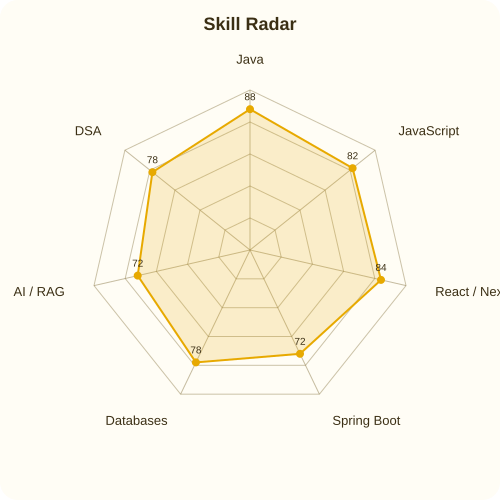
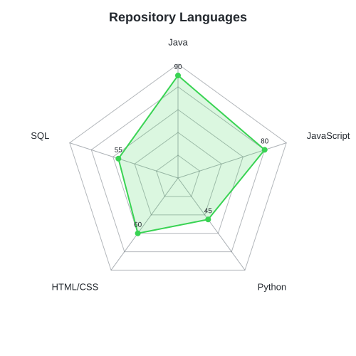
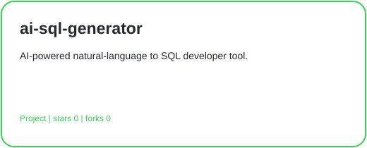
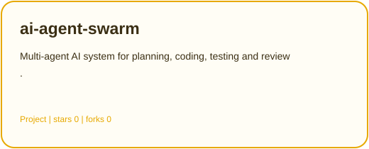
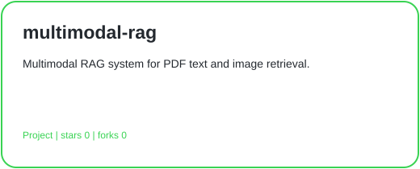
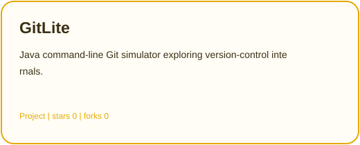
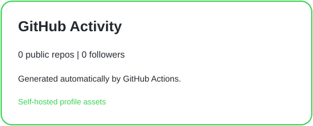

  
  
  
  

  

---

##  About

 

---

##  Tech Stack

---

##  Skills & GitHub

<table>
<tr>
<td width="50%" align="center" bgcolor="#FFFDF5">

###  My Skill Radar

<picture>
<source media="(prefers-color-scheme: dark)" srcset="assets/radar-dark.svg">
<source media="(prefers-color-scheme: light)" srcset="assets/radar-light.svg">

</picture>

</td>
<td width="50%" align="center" bgcolor="#FFF8E1">

###  Repository Languages

<picture>
<source media="(prefers-color-scheme: dark)" srcset="assets/radar-langs-dark.svg">
<source media="(prefers-color-scheme: light)" srcset="assets/radar-langs-light.svg">

</picture>

</td>
</tr>
</table>

---

##  Featured Projects

 <b>Other Projects</b> — click to expand

 

-  **SecureDoc** — Secure document management with authentication, storage and access control.
-  **NurseManagementSystem** — Full-stack nurse staffing and management application.
-  **DensePose Human Body Surface Mapper** — Computer-vision project for mapping human pixels to a 3D body-surface representation.
-  **AR Face Filter** — Augmented-reality face-filter project for real-time face detection, tracking and visual effects.

---

##  GitHub Overview

<picture>
<source media="(prefers-color-scheme: dark)" srcset="assets/stats-dark.svg">
<source media="(prefers-color-scheme: light)" srcset="assets/stats-light.svg">

</picture>

---

##  All GitHub Repositories

<table>
<tr>

<td width="50%" height="190" valign="top" bgcolor="#FFF8E1">

###  AI Agent Swarm

Multi-agent AI software engineering system for **planning, coding, testing and review**.

`Java` · `AI Agents` · `LLM`

 

</td>

<td width="50%" height="190" valign="top" bgcolor="#FFF8E1">

###  AI SQL Generator

AI-powered developer tool that converts **natural language into SQL queries**.

`Java` · `AI` · `SQL`

 

</td>

</tr>

<tr>

<td width="50%" height="190" valign="top" bgcolor="#FFF8E1">

###  Multimodal RAG

Multimodal **RAG system** for retrieving information from PDF text and images.

`Python` · `RAG` · `AI`

 

</td>

<td width="50%" height="190" valign="top" bgcolor="#FFF8E1">

###  GitLite

Java command-line **Git simulator** exploring version-control internals.

`Java` · `CLI` · `Git`

 

</td>

</tr>

<tr>

<td width="50%" height="190" valign="top" bgcolor="#FFF8E1">

###  SecureDoc

Secure document management system with **authentication, storage and access control**.

`JavaScript` · `Security` · `Full Stack`

 

</td>

<td width="50%" height="190" valign="top" bgcolor="#FFF8E1">

###  Nurse Management System

Full-stack application for **nurse staffing and management workflows**.

`JavaScript` · `Full Stack`

 

</td>

</tr>

<tr>

<td width="50%" height="190" valign="top" bgcolor="#FFF8E1">

###  DensePose Human Body Surface Mapper

Computer-vision project using **DensePose** for human body-surface mapping.

`Python` · `Computer Vision` · `DensePose`

 

</td>

<td width="50%" height="190" valign="top" bgcolor="#FFF8E1">

###  AR Face Filter

Real-time **augmented-reality face filter** with face tracking and interactive effects.

`JavaScript` · `AR` · `Computer Vision`

 

</td>

</tr>
</table>

---

##  Contribution Activity

<picture>
  <source
    media="(prefers-color-scheme: dark)"
    srcset="https://raw.githubusercontent.com/Samruddhi192105/Samruddhi192105/output/snake-dark.svg"
  />

  <source
    media="(prefers-color-scheme: light)"
    srcset="https://raw.githubusercontent.com/Samruddhi192105/Samruddhi192105/output/snake.svg"
  />

  

</picture>

---

##  Currently Learning

 

 

---

###  Build things that solve real problems.

**Build. Break. Learn. Ship. 🚀**

