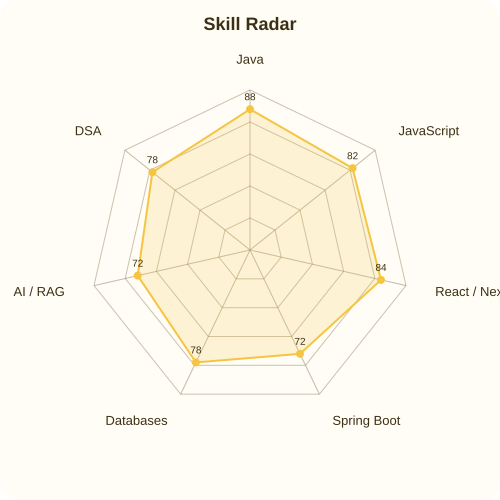
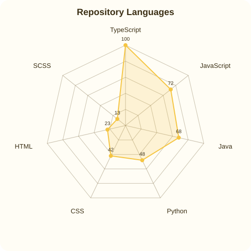
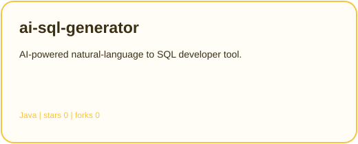
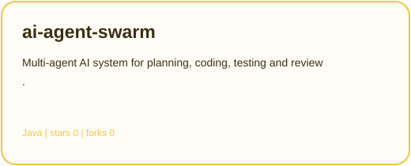
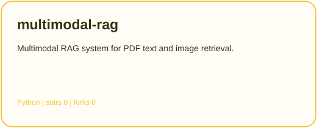
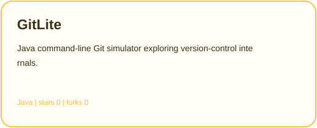

  
  
  
  

  
  

---

##  About

 

---

##  Tech Stack

---

##  Skills & GitHub

<table>
<tr>
<td width="50%" align="center" bgcolor="#FFFDF5">

###  My Skill Radar

<picture>
<source media="(prefers-color-scheme: dark)" srcset="assets/radar-dark.svg">
<source media="(prefers-color-scheme: light)" srcset="assets/radar-light.svg">

</picture>

</td>
<td width="50%" align="center" bgcolor="#FFF8E1">

###  Repository Languages

<picture>
<source media="(prefers-color-scheme: dark)" srcset="assets/radar-langs-dark.svg">
<source media="(prefers-color-scheme: light)" srcset="assets/radar-langs-light.svg">

</picture>

</td>
</tr>
</table>

---

##  Featured Projects

 <b>Other Projects</b> — click to expand

 

-  **SecureDoc** — Secure document management with authentication, storage and access control.
-  **NurseManagementSystem** — Full-stack nurse staffing and management application.
-  **DensePose Human Body Surface Mapper** — Computer-vision project for mapping human pixels to a 3D body-surface representation.
-  **AR Face Filter** — Augmented-reality face-filter project for real-time face detection, tracking and visual effects.

---

##  All GitHub Repositories

<!-- ALL_REPOS_START -->
| Repository | Language | Stars | Description |
|---|---|---:|---|
| [Portfolio](https://github.com/Samruddhi192105/Portfolio) | TypeScript | 0 | No description |
| [Samruddhi192105](https://github.com/Samruddhi192105/Samruddhi192105) | Python | 0 | No description |
| [GitLite](https://github.com/Samruddhi192105/GitLite) | TypeScript | 0 | GitLite is a Java version-control engine with a Next.js application for user accounts, isolated repositories, file brows |
| [ai-sql-generator](https://github.com/Samruddhi192105/ai-sql-generator) | Java | 0 | An AI-powered web application that converts natural-language requests into SQL queries using Java Spring Boot, Next.js,  |
| [ai-agent-swarm](https://github.com/Samruddhi192105/ai-agent-swarm) | Java | 0 | Multi-agent AI system that autonomously plans, codes, tests, and reviews software |
| [neetcode-submissions](https://github.com/Samruddhi192105/neetcode-submissions) | Java | 0 | My NeetCode.io problem submissions |
| [densepose-human-body-surface-mapper](https://github.com/Samruddhi192105/densepose-human-body-surface-mapper) | Python | 0 | A computer vision application that uses DensePose to map the visible human body surface into detailed body-part regions  |
| [Veylora](https://github.com/Samruddhi192105/Veylora) | Python | 0 | No description |
| [GymTracker](https://github.com/Samruddhi192105/GymTracker) | JavaScript | 0 | No description |
| [NurseManagementSystem](https://github.com/Samruddhi192105/NurseManagementSystem) | JavaScript | 0 | A full-stack web application designed to streamline nurse staffing and workforce management by connecting hospitals, sta |
| [AR-Face-Filter](https://github.com/Samruddhi192105/AR-Face-Filter) | Python | 0 | A real-time Augmented Reality Face Filter built using Python, OpenCV, and MediaPipe Face Landmarker.  The application us |
| [multimodal-rag](https://github.com/Samruddhi192105/multimodal-rag) | Python | 0 | A multimodal Retrieval-Augmented Generation system for retrieving and answering questions from PDF text and images. |
| [Backend-Module](https://github.com/Samruddhi192105/Backend-Module) | JavaScript | 0 | No description |
| [SecureDoc](https://github.com/Samruddhi192105/SecureDoc) | JavaScript | 0 | Secure Doc is a web-based application designed to securely manage, store, and handle documents with a focus on data safe |
| [employee-management-Spring-Boot-](https://github.com/Samruddhi192105/employee-management-Spring-Boot-) | Java | 0 | No description |
| [Company-specific-questions](https://github.com/Samruddhi192105/Company-specific-questions) | — | 0 | No description |
| [ExpenseTracker](https://github.com/Samruddhi192105/ExpenseTracker) | HTML | 0 | No description |
<!-- ALL_REPOS_END -->

---

##  Contribution Activity

<picture>
  <source
    media="(prefers-color-scheme: dark)"
    srcset="https://raw.githubusercontent.com/Samruddhi192105/Samruddhi192105/output/snake-dark.svg"
  />

  <source
    media="(prefers-color-scheme: light)"
    srcset="https://raw.githubusercontent.com/Samruddhi192105/Samruddhi192105/output/snake.svg"
  />

  

</picture>

---

##  Currently Learning

 

 

---

###  Build things that solve real problems.

**Build. Break. Learn. Ship. 🚀**

